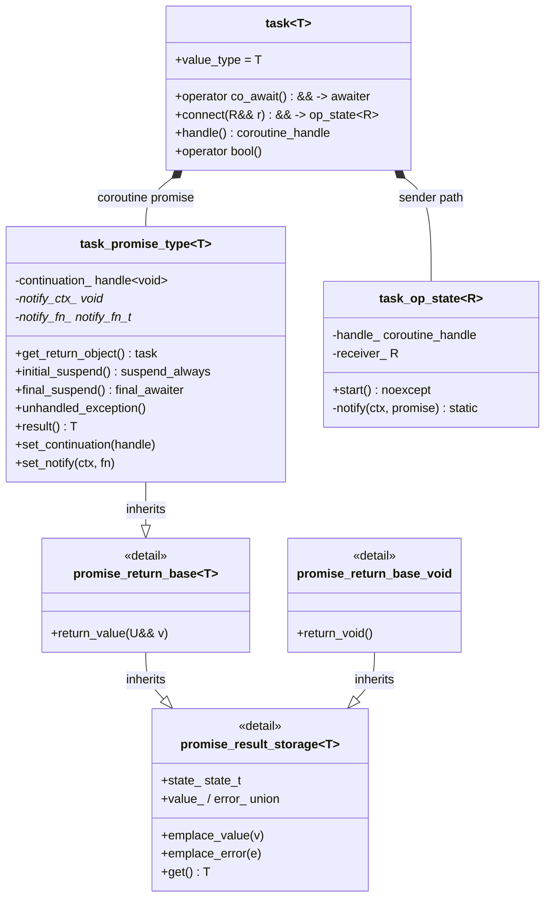
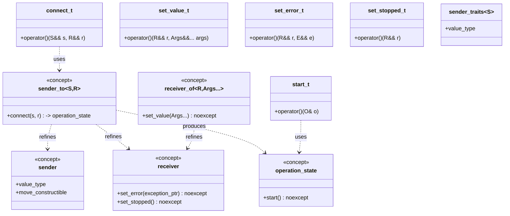
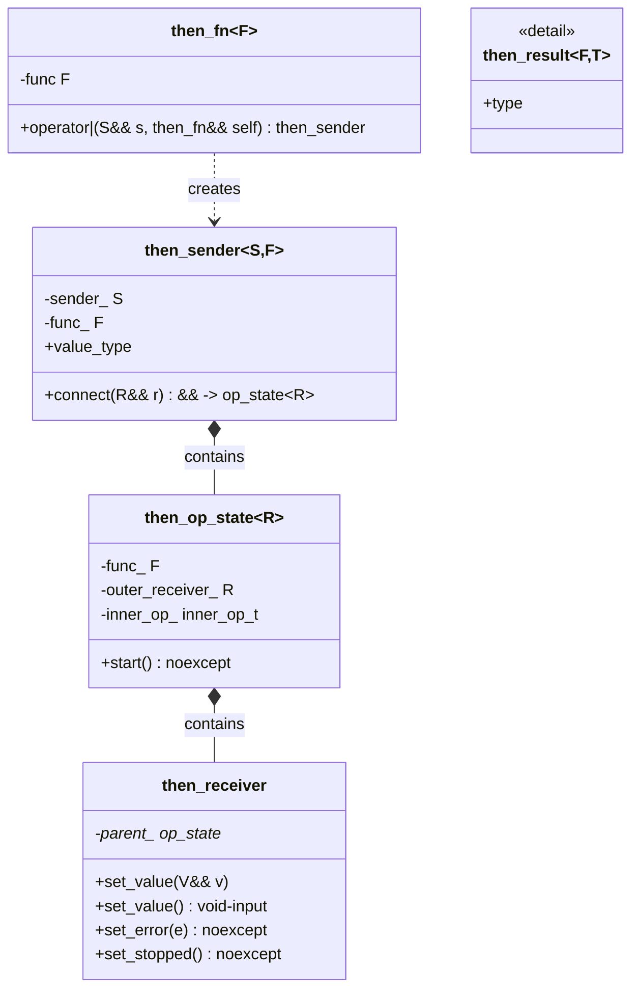
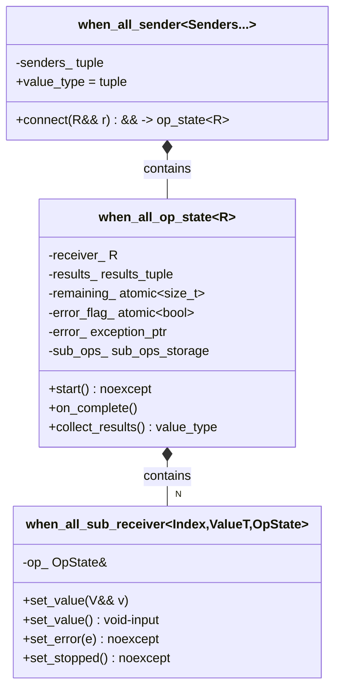
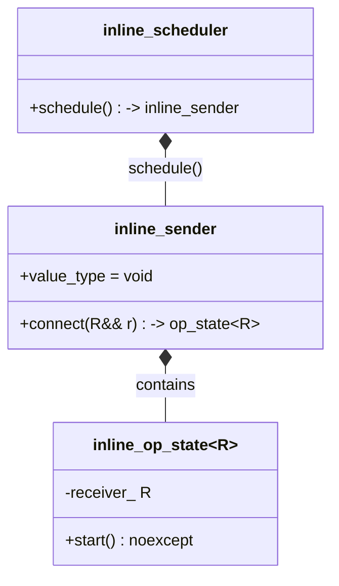
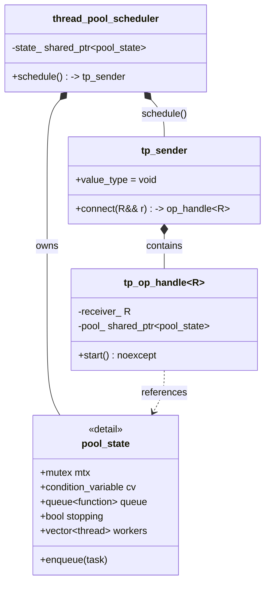
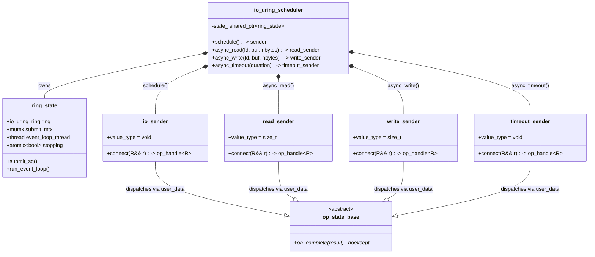
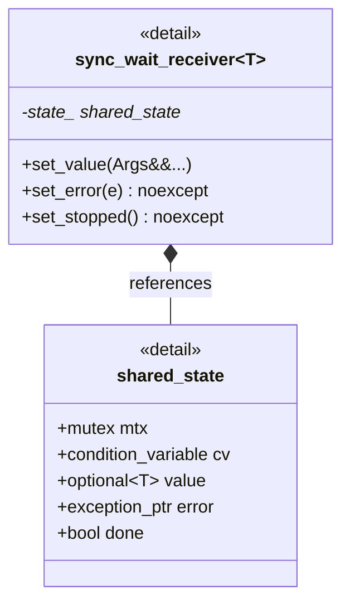
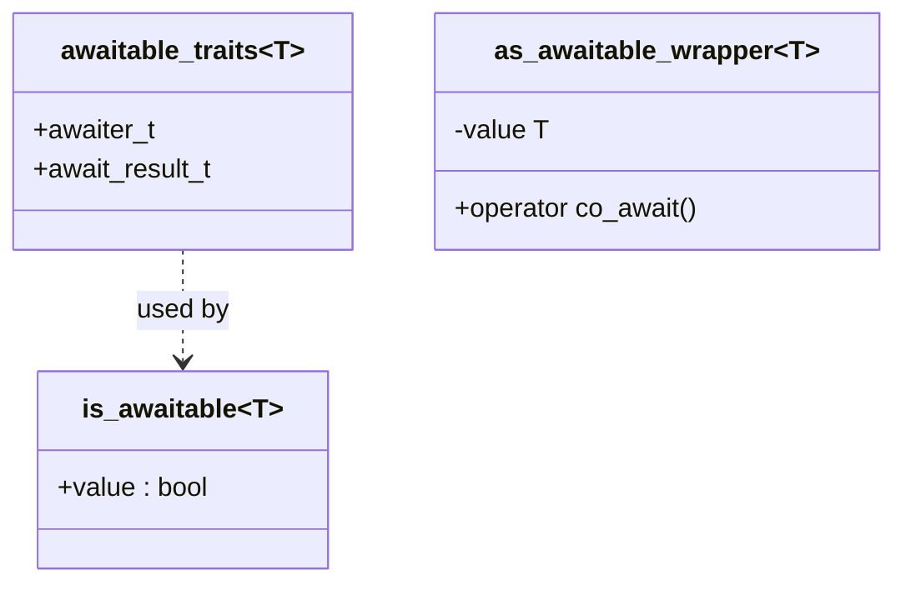

# coro library class diagrams

---

## 1. Core coroutine type: task<T>

---

## 2. Sender / Receiver protocol

---

## 3. Combinator: then

---

## 4. Combinator: when_all

---

## 5. Schedulers

### 5a. inline_scheduler

### 5b. thread_pool_scheduler

### 5c. io_uring_scheduler

### 5d. sync_wait (generic)

---

## 6. Awaitable utilities

---

## 7. Cross-module dependencies

```mermaid
classDiagram
    direction TB

    class task~T~
    class then_sender~S,F~
    class when_all_sender~Senders...~
    class inline_sender
    class tp_sender
    class io_sender
    class read_sender
    class write_sender
    class timeout_sender

    class sender {
        <<concept>>
    }

    class receiver {
        <<concept>>
    }

    class operation_state {
        <<concept>>
    }

    class set_value_t
    class set_error_t
    class set_stopped_t

    task~T~ ..|> sender : models
    then_sender~S,F~ ..|> sender : models
    when_all_sender~Senders...~ ..|> sender : models
    inline_sender ..|> sender : models
    tp_sender ..|> sender : models
    io_sender ..|> sender : models
    read_sender ..|> sender : models
    write_sender ..|> sender : models
    timeout_sender ..|> sender : models

    task~T~ ..> operation_state : connect() returns
    then_sender~S,F~ ..> operation_state : connect() returns
    when_all_sender~Senders...~ ..> operation_state : connect() returns
    inline_sender ..> operation_state : connect() returns
    tp_sender ..> operation_state : connect() returns
    io_sender ..> operation_state : connect() returns
    read_sender ..> operation_state : connect() returns
    write_sender ..> operation_state : connect() returns
    timeout_sender ..> operation_state : connect() returns

    task~T~ ..> set_value_t : calls via op_state
    task~T~ ..> set_error_t : calls via op_state
    then_sender~S,F~ ..> set_value_t : forwards
    then_sender~S,F~ ..> set_error_t : forwards
    when_all_sender~Senders...~ ..> set_value_t : forwards
    when_all_sender~Senders...~ ..> set_error_t : forwards
```

