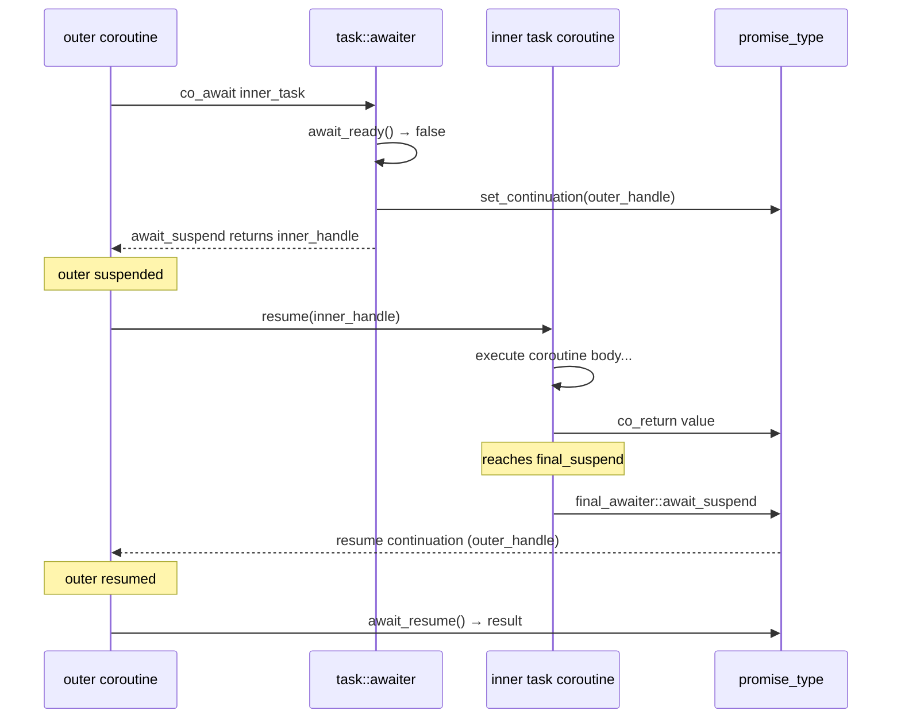
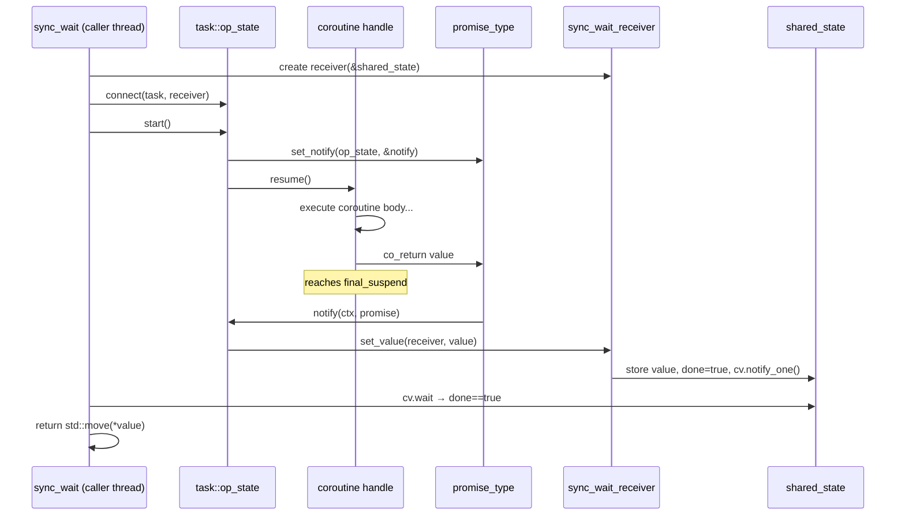
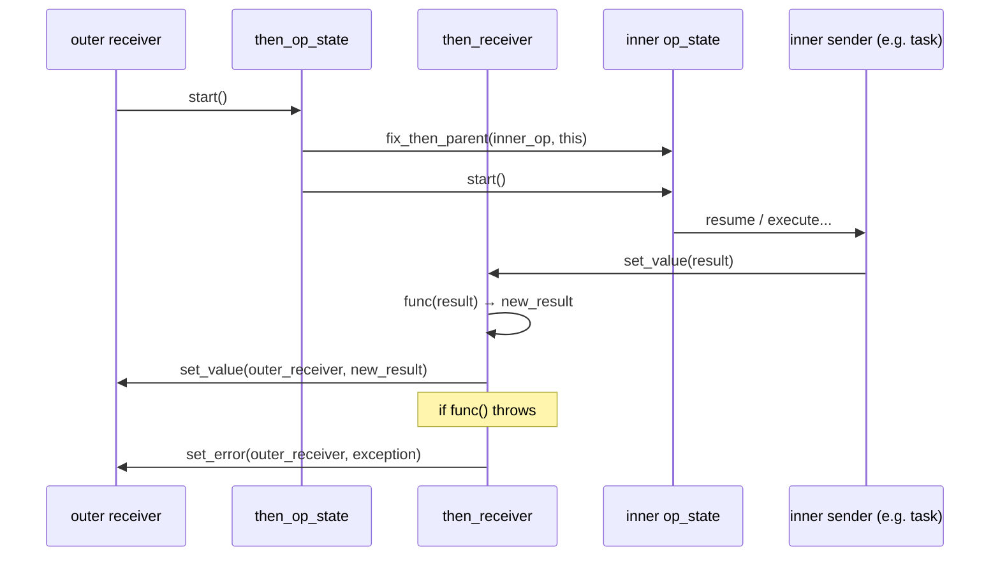
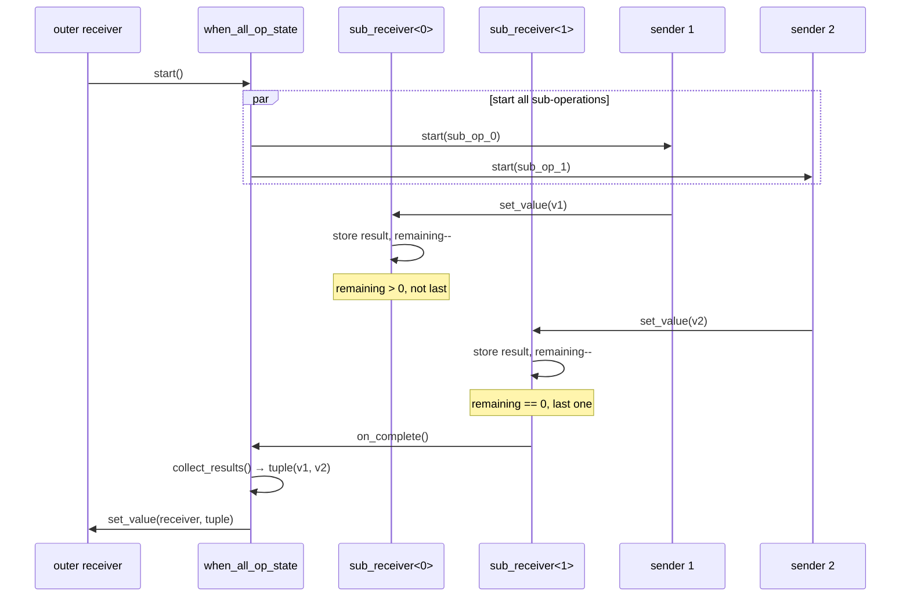

# `task<T>` Usage Guide

`task<T>` is the core coroutine type in coro — a **lazy, move-only** unit of asynchronous work. It models both an **awaitable** (usable with `co_await`) and a **sender** (usable with the Sender/Receiver protocol).

## Basics

### Creating a task

A task is created by defining a coroutine function that returns `task<T>`:

```cpp
#include <coro/coro.hpp>
using namespace coro;

task<int> compute() {
    co_return 42;
}
```

The function body is **not executed** until the task is awaited or started.

### `task<T>` vs `task<void>`

- `task<T>` — returns a value of type `T` via `co_return`
- `task<void>` — returns nothing, only `co_return;` or implicit return

```cpp
task<int>    get_value()  { co_return 10; }
task<void>   do_work()    { /* ... */ co_return; }
task<void>   do_work2()   { /* implicit return */ }
```

### Move-only, not copyable

```cpp
auto a = compute();
auto b = std::move(a);   // OK
auto c = b;              // compile error — task is not copyable
```

---

## Awaiting tasks with `co_await`

Inside another coroutine, use `co_await` to suspend and retrieve the result:

```cpp
task<int> double_it(int x) {
    co_return x * 2;
}

task<int> main_task() {
    int result = co_await double_it(21);  // suspends, resumes with 42
    co_return result;
}
```

### Awaiting `task<void>`

```cpp
task<void> log() {
    std::cout << "hello\n";
}

task<void> workflow() {
    co_await log();    // await completion, no value
    co_return;
}
```

### Awaiting throws on error

If the awaited task completed with an exception, `co_await` re-throws it:

```cpp
task<int> fail() {
    throw std::runtime_error("oops");
    co_return 0;  // unreachable
}

task<void> handler() {
    try {
        co_await fail();
    } catch (const std::exception& e) {
        std::cout << "caught: " << e.what() << '\n';
    }
}
```

### `co_await` any sender

`task<T>` has its own `operator co_await`, but the library also provides a **generic bridge** that makes **any sender** awaitable inside coroutines. This means you can `co_await` scheduler senders, `then` pipelines, and even `when_all` compositions directly:

```cpp
task<int> on_pool(thread_pool_scheduler& pool) {
    // co_await a scheduler sender — resumes on a worker thread
    co_await pool.schedule();
    co_return 42;
}
```

The generic `sender_awaiter` uses a race-free three-state atomic CAS protocol to guarantee exactly one resume path, eliminating double-resume UB. Scheduler senders (e.g. `thread_pool_scheduler::sender`) provide custom `operator co_await` for optimized thread-guaranteed resumption.

---

## Running tasks with `sync_wait`

`sync_wait` is the bridge from async to sync — it blocks until the task completes and returns the result (or re-throws the exception):

```cpp
task<int> answer() { co_return 42; }

int main() {
    int result = sync_wait(answer());
    std::cout << result << '\n';  // 42
}
```

### `sync_wait` with `task<void>`

Returns `void` — just waits for completion:

```cpp
task<void> greet() { std::cout << "hi\n"; }

sync_wait(greet());  // blocks until done
```

### `sync_wait` with exceptions

If the task fails, `sync_wait` re-throws:

```cpp
task<int> boom() { throw std::runtime_error("boom"); co_return 0; }

try {
    sync_wait(boom());
} catch (const std::runtime_error& e) {
    // handled
}
```

---

## Tasks as Senders — the `connect` / `start` protocol

`task<T>` models the **Sender** concept. You can connect it to a receiver and start it manually:

```cpp
task<int> t = compute();

// Connect to a receiver (which satisfies receiver_of<int>)
auto op = coro::connect(std::move(t), my_receiver);

// Start the operation
coro::start(op);
```

This is how `sync_wait` works internally — it creates an internal receiver, connects, starts, and waits on a condition variable.

---

## Composing tasks with combinators

### `then` — transform the result

Apply a function to a task's result, producing a new sender:

```cpp
task<int> get_number() { co_return 21; }

auto t = get_number() | then([](int x) { return x * 2; });
auto result = sync_wait(std::move(t));  // 42
```

`then` works with both `task<T>` and any other sender:

```cpp
// Chain multiple transforms
auto t = get_number()
    | then([](int x) { return x + 1; })   // 22
    | then([](int x) { return x * 2; });   // 44
auto r = sync_wait(std::move(t));
```

### `let_value` — flatMap / monadic bind

`let_value` is similar to `then`, but its function **returns a sender** rather than a plain value. The returned sender is automatically connected and started, and its result is forwarded to the downstream receiver. This is the async equivalent of monadic bind (`>>=`).

Use `let_value` when the next step of work depends on the previous result **and is itself async**:

```cpp
task<int> fetch_id() { co_return 42; }
task<std::string> fetch_name(int id) { co_return "user_" + std::to_string(id); }

auto pipeline = fetch_id()
    | let_value([](int id) {
          return fetch_name(id);   // returns task<std::string>
      });

auto name = sync_wait(std::move(pipeline));  // "user_42"
```

The difference from `then`:

| | `then` | `let_value` |
|---|---|---|
| Function returns | Plain value | **Sender** |
| Effect | Transform result | Launch new async work based on result |
| Use when | Synchronous transformation | Next step is also async |

**Note:** If you use `then` with a lambda that returns `task<T>`, you get a `sender<task<T>>` which requires two `sync_wait` calls to resolve. `let_value` flattens this into a single step.

### `when_all` — run multiple tasks concurrently

Wait for all tasks to complete and collect their results as a tuple:

```cpp
task<int> a() { co_return 1; }
task<int> b() { co_return 2; }

auto result = sync_wait(when_all(a(), b()));
// result == std::make_tuple(1, 2)
```

Mixed types work too:

```cpp
task<int>    num()  { co_return 42; }
task<void>   log()  { std::cout << "done\n"; }
task<std::string> str() { co_return "hello"; }

auto r = sync_wait(when_all(num(), log(), str()));
// r == std::tuple<int, void, std::string>
```

### Combining `then` + `when_all`

```cpp
auto r = sync_wait(
    when_all(compute(), compute())
    | then([](std::tuple<int, int> t) {
        return std::get<0>(t) + std::get<1>(t);
    })
);
```

---

## Tasks with schedulers

Schedulers are lightweight handles to execution resources (thread pools, event loops, etc.). In the P2300 design, a scheduler only exposes `schedule()`, which returns a `void` sender that completes on the scheduler's context.

### The canonical pattern: `co_await schedule(pool)` inside the coroutine

The idiomatic way to run a coroutine on a scheduler is to `co_await` the scheduler's sender from **within** the coroutine body. The coroutine suspends and resumes on the scheduler's execution context:

```cpp
task<int> compute_on_pool(thread_pool_scheduler& pool) {
    co_await pool.schedule();   // suspend, resume on a worker thread
    // now executing on the thread pool
    co_return 42;
}

auto result = sync_wait(compute_on_pool(pool));  // 42
```

This is the P2300-pure approach: the scheduler is an argument to the coroutine, and the coroutine itself decides when to transfer to that context.

### Bridging from non-coroutine code: `schedule() | then`

If you need to produce a task from outside a coroutine (e.g., in `main()`), you can use `schedule() | then`. However, if the lambda returns `task<T>`, the result is a nested `sender<task<T>>`:

```cpp
// Produces sender<task<int>> — the inner task is not yet started
auto t = pool.schedule() | then([] { return compute(); });
auto inner = sync_wait(std::move(t));      // task<int> (coroutine not started)
auto result = sync_wait(std::move(inner)); // 42
```

This two-step resolution is a direct consequence of P2300's lazy design: `compute()` creates a `task<int>` object, but the sender pipeline only sees the object, not the `int` inside it. Use `let_value` to flatten this into a single step:

```cpp
auto t = pool.schedule() | let_value([] {
    return compute();  // returns task<int>
});
auto result = sync_wait(std::move(t));  // 42, flattened to sender<int>
```

### Running multiple tasks on the pool

```cpp
auto t1 = compute_on_pool(pool);
auto t2 = compute_on_pool(pool);
auto [a, b] = sync_wait(when_all(std::move(t1), std::move(t2)));
```

Or using `let_value` to bridge from the outside:

```cpp
auto t = when_all(
    pool.schedule() | let_value([] { return compute(); }),
    pool.schedule() | let_value([] { return compute(); })
);
auto [a, b] = sync_wait(std::move(t));
```

### Schedulers available in coro

| Scheduler | Behavior |
|---|---|
| `inline_scheduler` | `schedule()` completes synchronously on the current thread |
| `thread_pool_scheduler` | `schedule()` completes on a worker thread from the pool; provides `executor()` accessor for io_uring integration |
| `io_uring_scheduler` | `schedule()` completes on the io_uring loop; also provides `async_read`/`async_write`/`async_timeout` senders; supports executor delegation via second constructor |

---

## Execution flow diagrams

### 1. `co_await task<T>` — coroutine-to-coroutine



### 2. `sync_wait(task<T>)` — Sender/Receiver path



### 3. `sender | then(func)` — transform pipeline



### 4. `when_all(s1, s2, ...)` — parallel composition



---

## `task<T>` API reference

| Member | Description |
|---|---|
| `task()` | Default constructor — creates an empty (null) task |
| `task(task&&)` | Move constructor — transfers ownership |
| `operator=(task&&)` | Move assignment — destroys previous, transfers ownership |
| `operator co_await() &&` | Makes the task awaitable inside coroutines |
| `connect(R&& r) &&` | Connects to a receiver (Sender protocol) |
| `handle()` | Returns the underlying `std::coroutine_handle<promise_type>` |
| `operator bool()` | Returns `true` if the task holds a valid coroutine |

### Promise type API (inside the coroutine body)

| Method | Description |
|---|---|
| `return_value(T)` / `return_void()` | Set the result via `co_return` |
| `result()` | Retrieve the result (called by awaiter / op_state) |
| `set_continuation(handle)` | Set the next coroutine to resume after completion |
| `set_notify(ctx, fn)` | Register a callback for completion (used by Sender path) |

---

## Common patterns

### Error propagation through the pipeline

Exceptions automatically flow through `then`, `when_all`, and `sync_wait`:

```cpp
task<int> step1() { co_return 10; }

// step2 throws — sync_wait catches it
try {
    auto r = sync_wait(
        step1() | then([](int x) {
            throw std::runtime_error("fail");
            return x;
        })
    );
} catch (const std::exception&) {
    // handled
}
```

### Nested `co_await` — sequential composition

```cpp
task<int> fetch() { co_return 100; }
task<int> process(int x) { co_return x / 2; }
task<void> save(int x) { /* ... */ }

task<int> pipeline() {
    int a = co_await fetch();       // step 1
    int b = co_await process(a);    // step 2
    co_await save(b);               // step 3
    co_return b;
}
```

### Conditional execution

```cpp
task<int> maybe(bool condition) {
    if (condition) {
        co_return co_await fetch_a();
    } else {
        co_return co_await fetch_b();
    }
}
```

### Task lifetime management

A task destroys its coroutine frame when it goes out of scope (if not awaited):

```cpp
{
    auto t = compute();
    // t destroyed here — coroutine frame destroyed, result never retrieved
}
```

To avoid leaks, always `co_await` or `sync_wait` your tasks.
