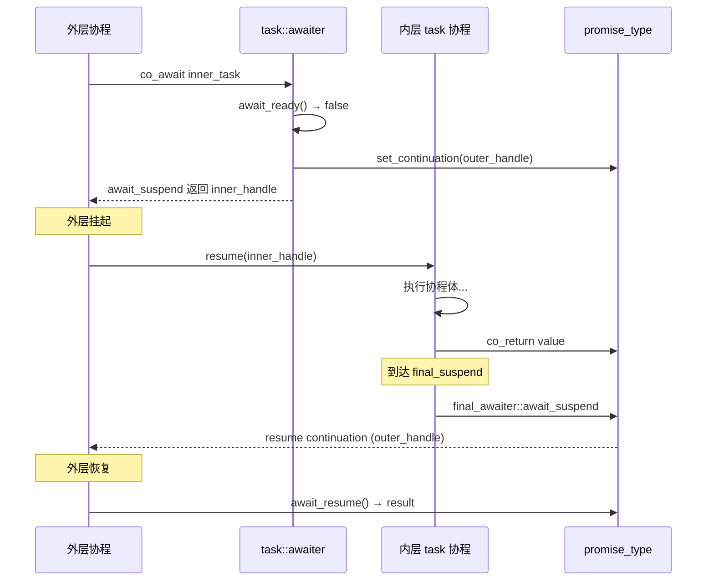
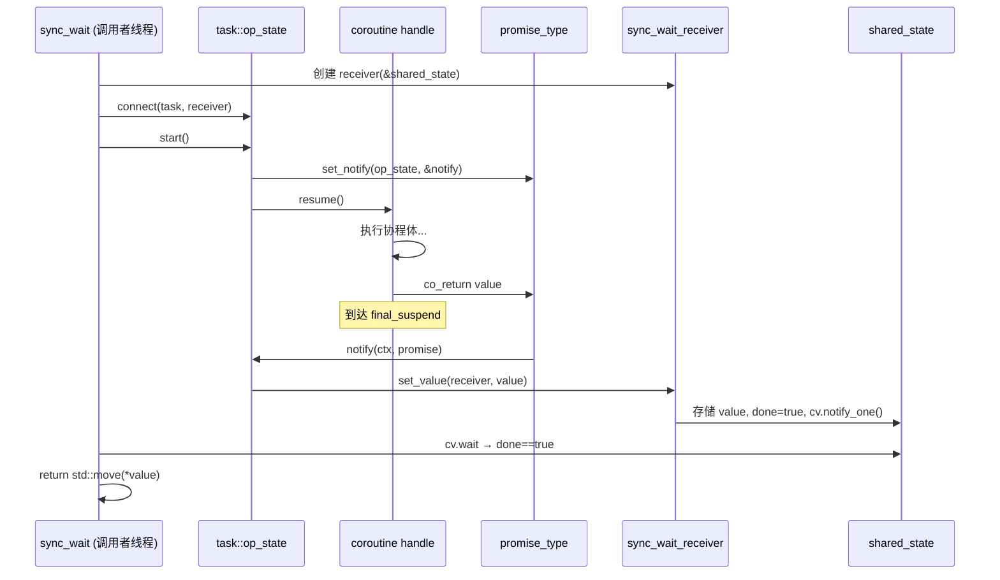
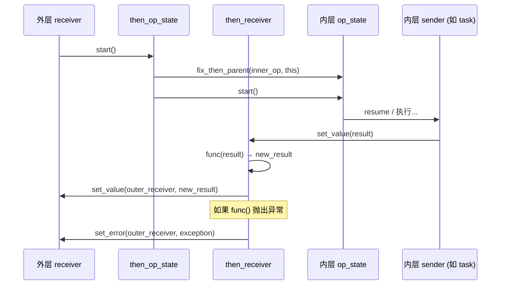
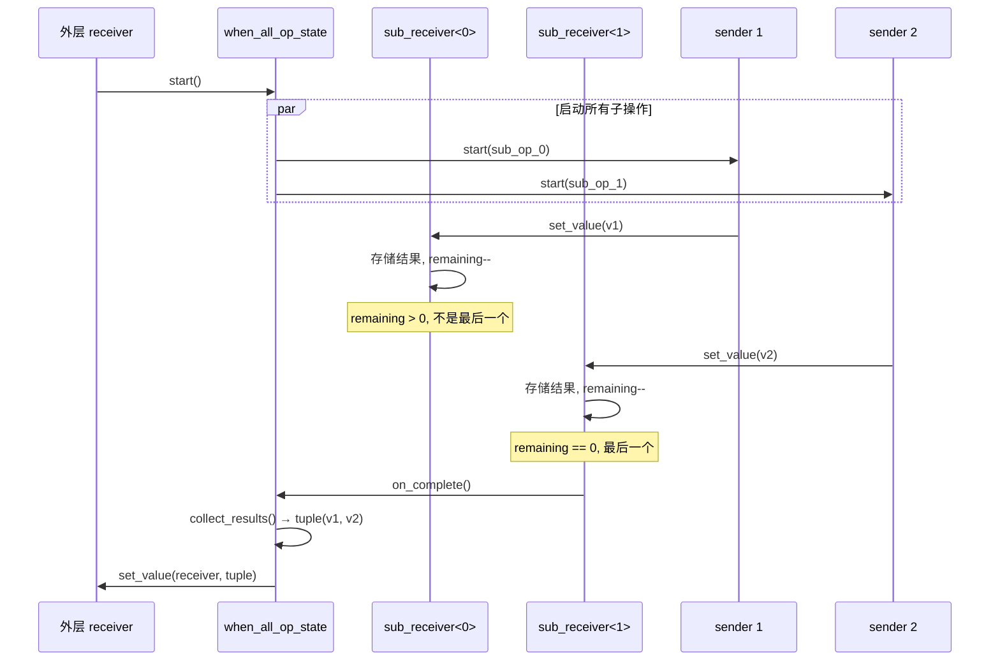

# `task<T>` 使用指南

`task<T>` 是 coro 库的核心协程类型 —— 一个**惰性求值、仅可移动**的异步工作单元。它同时满足**可等待对象**（可用 `co_await`）和**Sender**（可用于 Sender/Receiver 协议）两种模型。

## 基础

### 创建 task

通过定义返回 `task<T>` 的协程函数来创建 task：

```cpp
#include <coro/coro.hpp>
using namespace coro;

task<int> compute() {
    co_return 42;
}
```

函数体在 task 被等待或启动之前**不会执行**。

### `task<T>` vs `task<void>`

- `task<T>` — 通过 `co_return` 返回类型为 `T` 的值
- `task<void>` — 不返回值，仅使用 `co_return;` 或隐式返回

```cpp
task<int>    get_value()  { co_return 10; }
task<void>   do_work()    { /* ... */ co_return; }
task<void>   do_work2()   { /* 隐式返回 */ }
```

### 仅可移动，不可复制

```cpp
auto a = compute();
auto b = std::move(a);   // 可以
auto c = b;              // 编译错误 — task 不可复制
```

---

## 使用 `co_await` 等待 task

在另一个协程中，使用 `co_await` 挂起并获取结果：

```cpp
task<int> double_it(int x) {
    co_return x * 2;
}

task<int> main_task() {
    int result = co_await double_it(21);  // 挂起，恢复后返回 42
    co_return result;
}
```

### 等待 `task<void>`

```cpp
task<void> log() {
    std::cout << "hello\n";
}

task<void> workflow() {
    co_await log();    // 等待完成，无返回值
    co_return;
}
```

### 等待时抛出异常

如果被等待的 task 以异常完成，`co_await` 会重新抛出它：

```cpp
task<int> fail() {
    throw std::runtime_error("oops");
    co_return 0;  // 不可达
}

task<void> handler() {
    try {
        co_await fail();
    } catch (const std::exception& e) {
        std::cout << "caught: " << e.what() << '\n';
    }
}
```

---

## 使用 `sync_wait` 运行 task

`sync_wait` 是异步到同步的桥梁 —— 它会阻塞直到 task 完成并返回结果（或重新抛出异常）：

```cpp
task<int> answer() { co_return 42; }

int main() {
    int result = sync_wait(answer());
    std::cout << result << '\n';  // 42
}
```

### `sync_wait` 与 `task<void>`

返回 `void` —— 仅等待完成：

```cpp
task<void> greet() { std::cout << "hi\n"; }

sync_wait(greet());  // 阻塞直到完成
```

### `sync_wait` 与异常

如果 task 失败，`sync_wait` 会重新抛出：

```cpp
task<int> boom() { throw std::runtime_error("boom"); co_return 0; }

try {
    sync_wait(boom());
} catch (const std::runtime_error& e) {
    // 已处理
}
```

---

## Task 作为 Sender —— `connect` / `start` 协议

`task<T>` 满足 **Sender** 概念。你可以手动将它连接到 receiver 并启动：

```cpp
task<int> t = compute();

// 连接到 receiver（满足 receiver_of<int>）
auto op = coro::connect(std::move(t), my_receiver);

// 启动操作
coro::start(op);
```

这就是 `sync_wait` 的内部工作原理 —— 它创建一个内部 receiver，连接、启动，然后在条件变量上等待。

---

## 使用组合器组合 task

### `then` —— 转换结果

对 task 的结果应用一个函数，生成一个新的 sender：

```cpp
task<int> get_number() { co_return 21; }

auto t = get_number() | then([](int x) { return x * 2; });
auto result = sync_wait(std::move(t));  // 42
```

`then` 对 `task<T>` 和任何其他 sender 都有效：

```cpp
// 链式多个转换
auto t = get_number()
    | then([](int x) { return x + 1; })   // 22
    | then([](int x) { return x * 2; });   // 44
auto r = sync_wait(std::move(t));
```

### `let_value` —— flatMap / monadic bind

`let_value` 与 `then` 类似，但其函数**返回一个 sender** 而不是普通值。返回的 sender 会被自动连接并启动，其结果被转发给下游 receiver。这是 monadic bind（`>>=`）的异步版本。

当下一步工作依赖于前一步结果**且本身也是异步的**时，使用 `let_value`：

```cpp
task<int> fetch_id() { co_return 42; }
task<std::string> fetch_name(int id) { co_return "user_" + std::to_string(id); }

auto pipeline = fetch_id()
    | let_value([](int id) {
          return fetch_name(id);   // 返回 task<std::string>
      });

auto name = sync_wait(std::move(pipeline));  // "user_42"
```

与 `then` 的区别：

| | `then` | `let_value` |
|---|---|---|
| 函数返回 | 普通值 | **Sender** |
| 效果 | 转换结果 | 基于结果启动新的异步工作 |
| 适用场景 | 同步转换 | 下一步也是异步的 |

**注意：** 如果用 `then` 搭配返回 `task<T>` 的 lambda，会得到一个 `sender<task<T>>`，需要两次 `sync_wait` 才能解析。`let_value` 将其扁平化为单步操作。

### `when_all` —— 并发运行多个 task

等待所有 task 完成，并将结果收集为 tuple：

```cpp
task<int> a() { co_return 1; }
task<int> b() { co_return 2; }

auto result = sync_wait(when_all(a(), b()));
// result == std::make_tuple(1, 2)
```

混合类型也可以：

```cpp
task<int>    num()  { co_return 42; }
task<void>   log()  { std::cout << "done\n"; }
task<std::string> str() { co_return "hello"; }

auto r = sync_wait(when_all(num(), log(), str()));
// r == std::tuple<int, void, std::string>
```

### `then` + `when_all` 组合

```cpp
auto r = sync_wait(
    when_all(compute(), compute())
    | then([](std::tuple<int, int> t) {
        return std::get<0>(t) + std::get<1>(t);
    })
);
```

---

## Task 与调度器

调度器是执行资源（线程池、事件循环等）的轻量代理。在 P2300 设计中，调度器只暴露 `schedule()`，返回一个在该调度器上下文上完成的 `void` sender。

### 标准用法：在协程内部 `co_await schedule(pool)`

在调度器上运行协程的标准方式是在**协程体内部** `co_await` 调度器的 sender。协程会挂起，然后在调度器的执行上下文上恢复：

```cpp
task<int> compute_on_pool(thread_pool_scheduler& pool) {
    co_await pool.schedule();   // 挂起，在工作线程上恢复
    // 现在在线程池上执行
    co_return 42;
}

auto result = sync_wait(compute_on_pool(pool));  // 42
```

这是 P2300 纯惰性风格的做法：调度器作为参数传入协程，由协程自身决定何时转移到该上下文。

### 从外部桥接：`schedule() | then`

如果你需要在协程外部（如 `main()` 中）产生一个 task，可以使用 `schedule() | then`。但如果 lambda 返回 `task<T>`，结果会是嵌套的 `sender<task<T>>`：

```cpp
// 产生 sender<task<int>> —— 内部 task 尚未启动
auto t = pool.schedule() | then([] { return compute(); });
auto inner = sync_wait(std::move(t));      // task<int>（协程未启动）
auto result = sync_wait(std::move(inner)); // 42
```

两步解析是 P2300 惰性设计的直接结果：`compute()` 创建了 `task<int>` 对象，但 sender 管道只看到这个对象，而不是里面的 `int`。使用 `let_value` 可将其扁平化为单步：

```cpp
auto t = pool.schedule() | let_value([] {
    return compute();  // 返回 task<int>
});
auto result = sync_wait(std::move(t));  // 42，扁平化为 sender<int>
```

### 在线程池上运行多个 task

```cpp
auto t1 = compute_on_pool(pool);
auto t2 = compute_on_pool(pool);
auto [a, b] = sync_wait(when_all(std::move(t1), std::move(t2)));
```

或使用 `let_value` 从外部桥接：

```cpp
auto t = when_all(
    pool.schedule() | let_value([] { return compute(); }),
    pool.schedule() | let_value([] { return compute(); })
);
auto [a, b] = sync_wait(std::move(t));
```

### coro 中的调度器

| 调度器 | 行为 |
|---|---|
| `inline_scheduler` | `schedule()` 在当前线程同步完成 |
| `thread_pool_scheduler` | `schedule()` 在线程池的某个工作线程上完成 |
| `io_uring_scheduler` | `schedule()` 在 io_uring 循环上完成；另外提供 `async_read`/`async_write`/`async_timeout` sender |

---

## 执行流程图

### 1. `co_await task<T>` —— 协程到协程



### 2. `sync_wait(task<T>)` —— Sender/Receiver 路径



### 3. `sender | then(func)` —— 转换管道



### 4. `when_all(s1, s2, ...)` —— 并发组合



---

## `task<T>` API 参考

| 成员 | 说明 |
|---|---|
| `task()` | 默认构造函数 —— 创建一个空（null）task |
| `task(task&&)` | 移动构造函数 —— 转移所有权 |
| `operator=(task&&)` | 移动赋值 —— 销毁之前的，转移所有权 |
| `operator co_await() &&` | 使 task 在协程内可等待 |
| `connect(R&& r) &&` | 连接到 receiver（Sender 协议） |
| `handle()` | 返回底层的 `std::coroutine_handle<promise_type>` |
| `operator bool()` | 若 task 持有有效协程则返回 `true` |

### Promise type API（在协程体内）

| 方法 | 说明 |
|---|---|
| `return_value(T)` / `return_void()` | 通过 `co_return` 设置结果 |
| `result()` | 获取结果（由 awaiter / op_state 调用） |
| `set_continuation(handle)` | 设置完成后要恢复的下个协程 |
| `set_notify(ctx, fn)` | 注册完成回调（Sender 路径使用） |

---

## 常见模式

### 管道中的错误传播

异常自动流经 `then`、`when_all` 和 `sync_wait`：

```cpp
task<int> step1() { co_return 10; }

// step2 抛出异常 —— sync_wait 捕获它
try {
    auto r = sync_wait(
        step1() | then([](int x) {
            throw std::runtime_error("fail");
            return x;
        })
    );
} catch (const std::exception&) {
    // 已处理
}
```

### 嵌套 `co_await` —— 顺序组合

```cpp
task<int> fetch() { co_return 100; }
task<int> process(int x) { co_return x / 2; }
task<void> save(int x) { /* ... */ }

task<int> pipeline() {
    int a = co_await fetch();       // 步骤 1
    int b = co_await process(a);    // 步骤 2
    co_await save(b);               // 步骤 3
    co_return b;
}
```

### 条件执行

```cpp
task<int> maybe(bool condition) {
    if (condition) {
        co_return co_await fetch_a();
    } else {
        co_return co_await fetch_b();
    }
}
```

### Task 生命周期管理

Task 在超出作用域时会销毁其协程帧（如果未被等待）：

```cpp
{
    auto t = compute();
    // t 在这里销毁 —— 协程帧被销毁，结果永远不会获取
}
```

为避免泄漏，始终对你的 task 使用 `co_await` 或 `sync_wait`。
